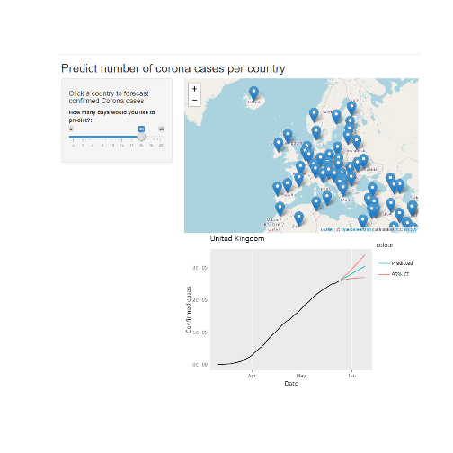

Predicting Corona cases per country
=====================================================
transition: linear
author: Jenny Eriksson
date: 2020-05-24
autosize: true

What
========================================================
 The application is an interactive tool for visualising how many confirmed COVID-19 cases each country has had, with a forecast on how many expected cases their are within the following days.

 

Why
====================================================
incremental: true
- Visualisation

    Visualising data for COVID-19 gives each government and health care system the possibility to compare to other countries as well as understanding if they have reached a plateau.

- Prediction

    By predicting the number of Covid-19 cases will be reported the coming days, each country can prepare their health care system in a procative way.

The application
========================================================
Go to the [official app]("https://jennyeeriksson.shinyapps.io/corona-prediction/") for a full view.

The app works in the way that the user clicks a country (onyl the ones with confirmed cases>500 will be displayed), decides how many days should be forecasted and then view the result in the graph below.

Technical details
========================================================
incremental: true
- Data

    The data comes from [John Hopking Unversity]("https://github.com/CSSEGISandData/COVID-19/tree/master/csse_covid_19_data")
Each time the server is called the latest data is fetched and cleaned into a tidy dataset, grouping the reported cases for each country.

- Model

    The forecasting is performed by fitting an ARMA model (forecast package) to the data for each country.
